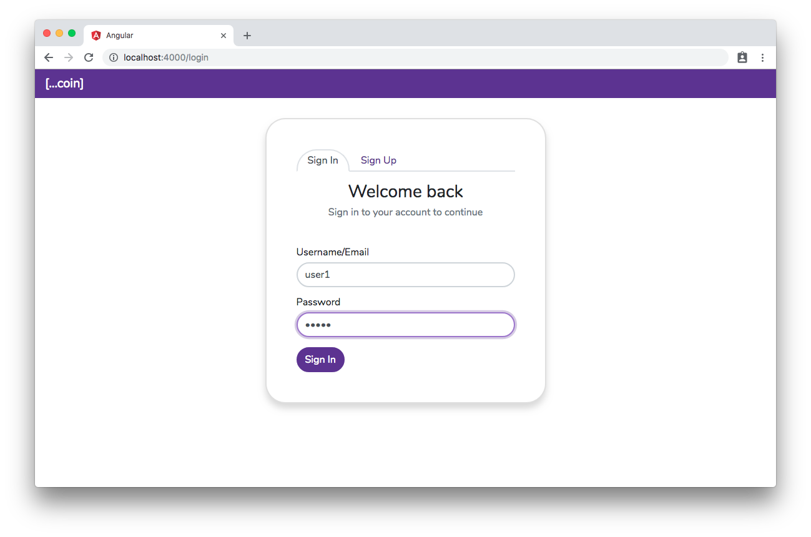

# Lab 11 - Cross-Site Scripting (XSS)

## Scenario

The Coinspread application is facing a security issue caused by the Cross Site Scripting.
As part of this lab, your mission is to mitigate the XSS issue by adding Content Security Policy (CSP) response header.

## Setup
1. Install the [helmet](https://www.npmjs.com/package/helmet) package from npm:
`npm i helmet --save`
2. Create two users (say, user1, and user2) on the coinspread app using the signup form.
3. Signin as user1, add a wallet with any currency and amount.
4. From 'Out there' menu add user2 as a friend.

## Tasks:

Here are the tasks for this lab

**Task 1: Review XSS vulnerability on the application**
Note: In general, the Angular and most of the modern front-end frameworks such as React and Vue handle the context-specific encoding unless explicitly coded to use unsafe methods. For this lab, the front-end code deliberately uses Angular framework's non-standard elements to manifest the XSS execution. The primary focus of this lab is to prevent XSS using Content Security Policy header set on the server, despite of the deliberately vulnerable code running on the browser.

Follow these steps to manifest the XSS issue:

- Sign in with username user1 as an attacker.

- On the Friends menu, click on the *Pay* button for friend @user2 
- On the Pay form, select any wallet and positive amount. In the *Note* text area add malicious XSS payload. For example ``

- Sign out and sign in with username user2 as a victim user.

- On clicking the activity menu, the malicious XSS payload injected by the user1 executes.
 
Here the token is shown in an alert box, but an attacker can send this token to any remote server and impersonate as the victim user.

**Task 2: Prevent XSS by adding the Content Security Policy (CSP) Response headers**

Using the `helmet` npm package's [contentSecurityPolicy](https://helmetjs.github.io/docs/csp/) module, update the server.js (inside coinspread/web-server/app folder) to include Content Security Policy using directives to whitelist trusted sources for following contents:
- CSS styles from the same server (self) and 'https://fonts.googleapis.com/css'. It is also acceptable to have inline styles (unsafe-inline) as the Angular bundle inlines the CSS inside the html markup.
- Javascript code from the same server (self). Apparently, the Angular framework's bundled code uses eval function, hence we would also need to add 'unsafe-eval' to the list.
- Font files from google fonts site 'https://fonts.gstatic.com'
- API Connection to coinspread application server "http://localhost:3000"
- Default policy to allow resources from the same origin (self) for any resources not specifically listed in the policy.

After the CSP header is added, signin as user2 and visit the Activity page. Do you notice any difference this time? 

## Quiz:
What specific CSP resource directive made the difference in preventing the malicicous XSS payload execution? 

Hint: Errors on Browser Developer Tool's Console could point you to the answer.