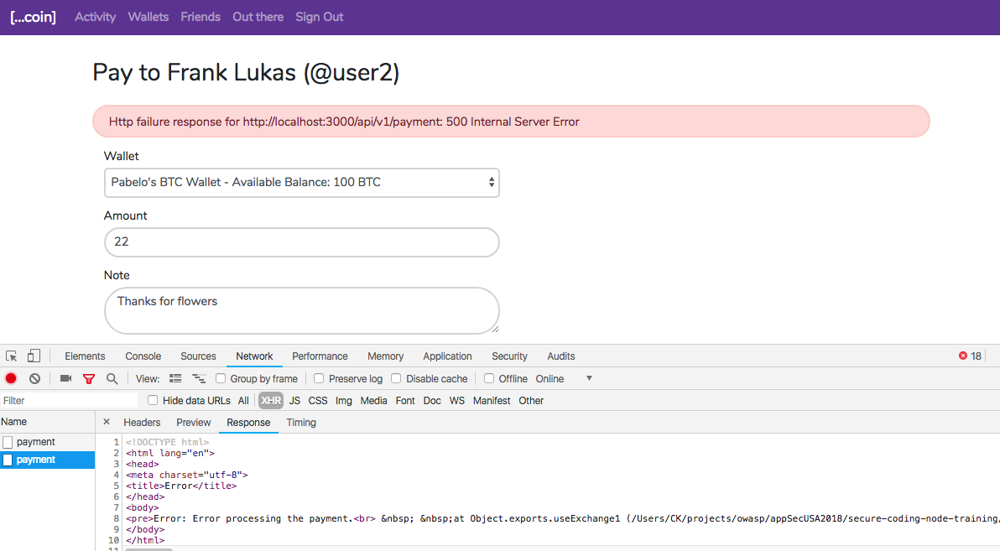
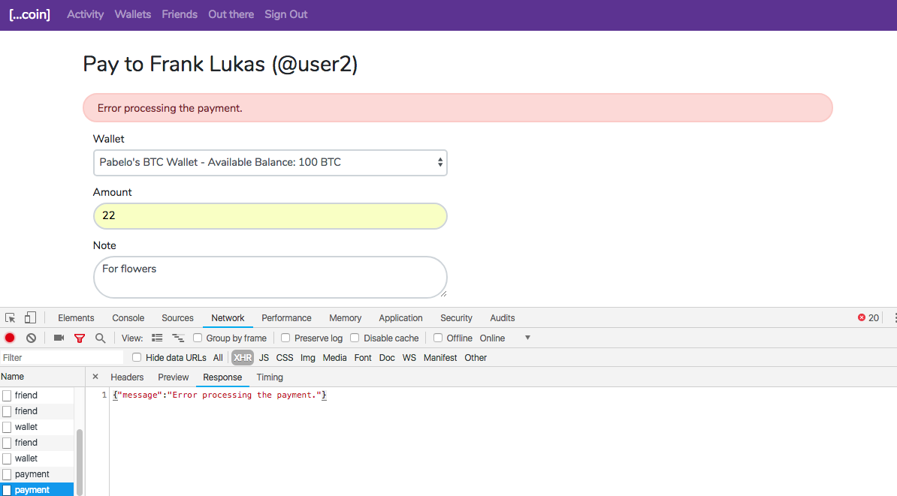
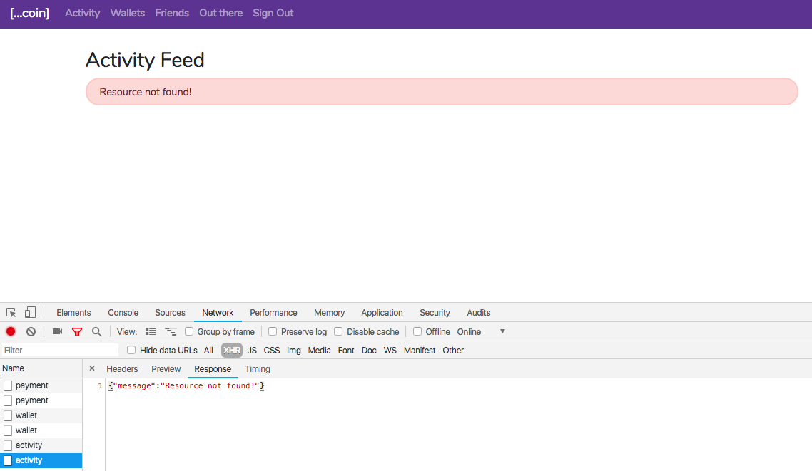
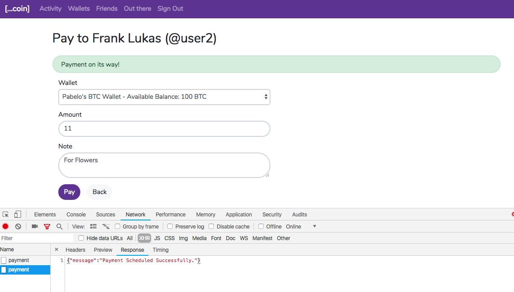
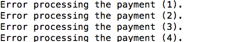

# Lab 2 - Error Handling  

## Setup

* Start the Coinspread client and server applications by running `npm i` followed by `npm start` inside the `client\angular` and `server` folders.
* Login with any existing user, or sign up to create a new user.
* Create a wallet from the Wallets menu, if none exists
* On Friends menu, if no friends exist, click on the 'Out there' menu and add a user to Friends. (If no users are shown on the 'Out there' menu, create additional users in the application using the signup tab on the login page.)

## Tasks:

**Task 1: Add Express Custom Error Handler**

The application doesn't include any custom error handler. As a result, any uncaught synchronous error or asynchronous errors passed to `next(err)` get caught by the Express default error handler. The Express default error handler sends the error to the client in HTML format, which is not desirable. For example here is an error response received as seen in the chrome dev tools area at the bottom. .

As part of this task, add a [custom error handler](https://expressjs.com/en/guide/error-handling.html) in the `app/app.error.handler.js` that sends error message in format {"message": <Error Message>}".

As a result, the UI should receive and show errors as below.
.


**Task 2: Use Boom API method to generate error objects**

1. Click on the Activity link on the menu bar. It is expected to get a 404 response as this route is not implemented in the lab code.
2. In the `app/app.error.handler.js`, locate a middleware that handles calls to any unimplemented routes, sending a 404 response.
3. Replace the error generation logic to use the [notFound()](https://github.com/hapijs/boom#boomnotfoundmessage-data) method from Boom with an error message 'Resource not found!'.
4. As a result, on clicking the 'Activity' menu, you should get this error response on the UI.


**Task 3: Handle synchronous and asynchronous errors**

In the 'Friends' menu, on making a payment to a user, the application fails with an error - *Error processing the payment.*
.

This error results from missing error handling in the `processPayment` method in `api/resources/payment/payment.controller.js` -

```javascript
const processPayment = (paymentInfo) => {
    paymentGateway.useExchange1();
    paymentGateway.useExchange2();
    paymentGateway.useExchange3();
    paymentGateway.useExchange4();
    paymentGateway.useExchange5();
};
```
The first four `useExchangeX()` methods delivers errors in four different mechanisms - throws clause, callback param, event emitter, and rejected promise, respectivly. As part of this task, handle errors sent from the useExchangeX() methods and print the error message on console. As a result, the execution should continue to the final `useExchange5()` method and complete successfully, with success message as below:

You should see the following messages on the server console after the error handler prints the error message on console. .


## Quiz

If not handled correctly, which of the error delivery mechanisms result in crashing the server.