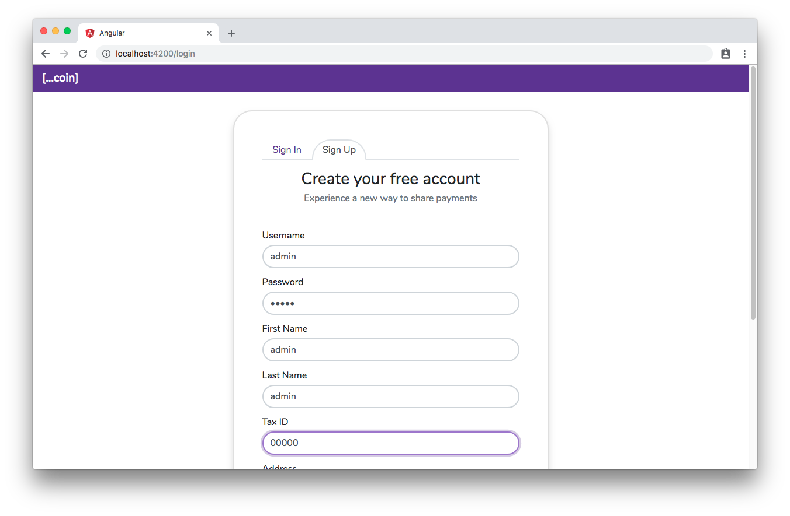
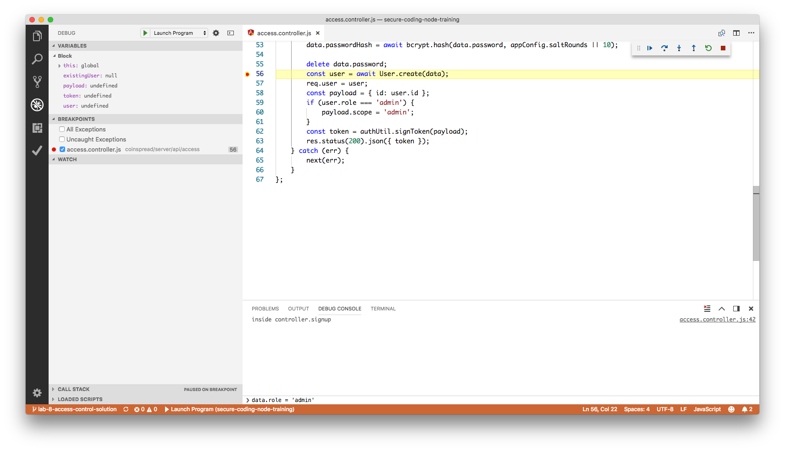
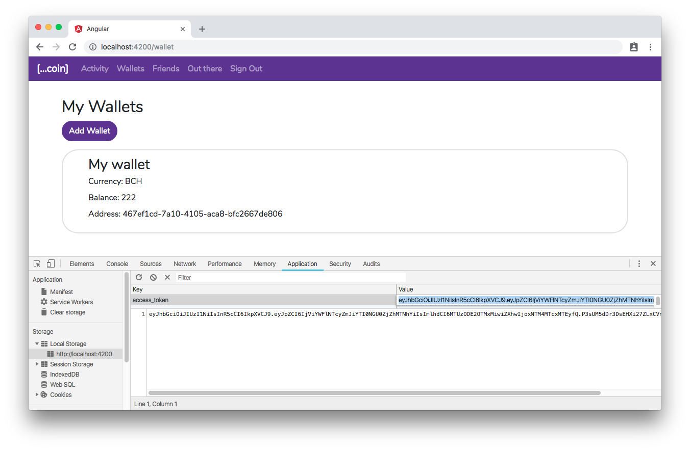
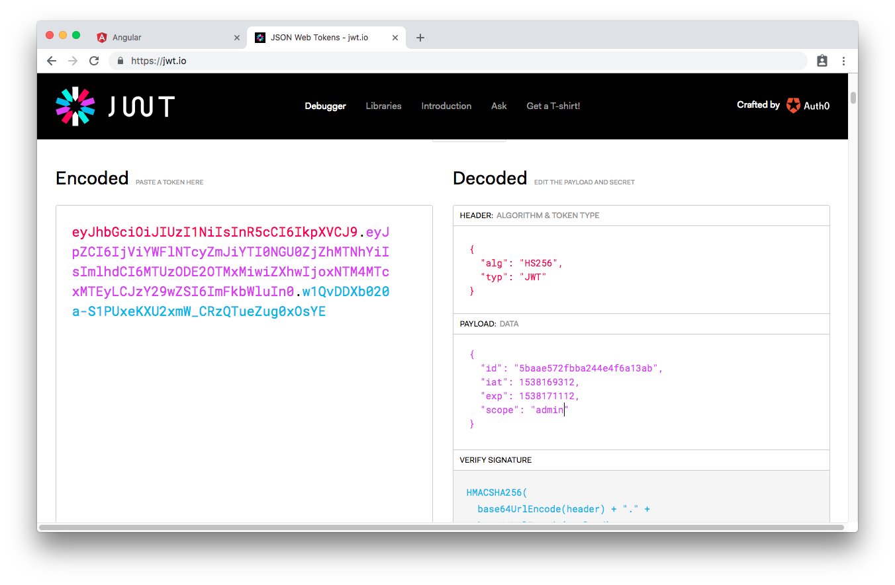
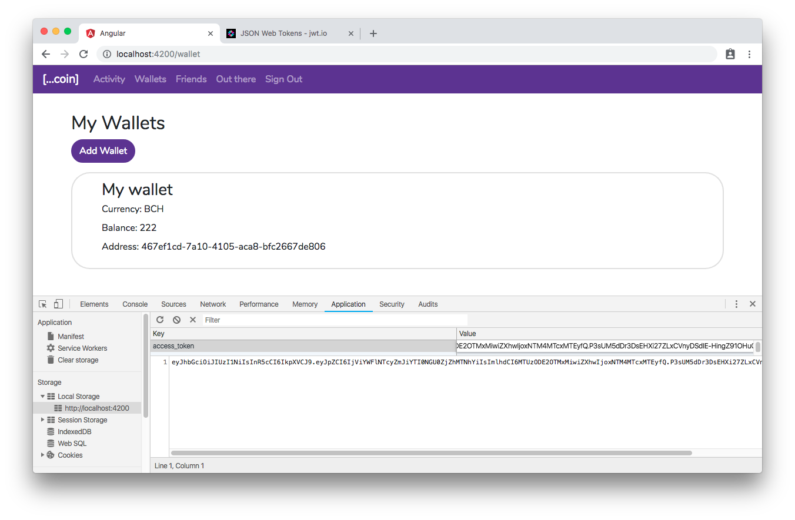
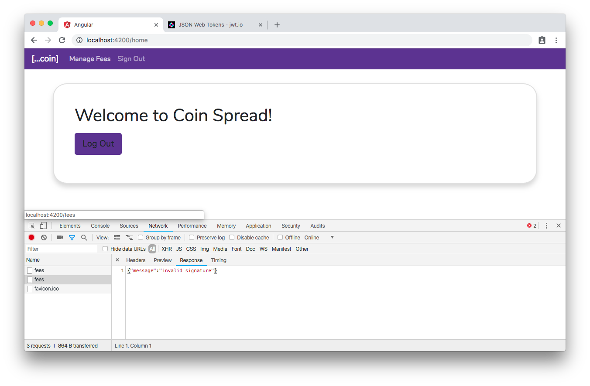

# Lab 8 - Access Control

## Scenario

The coinspread app's access control is broken and needs your help to fix these weaknesses:

**1. Missing Function Level Access Control:**

The coinspread application contains a feature to set transaction fees. This feature is intended to be accessible only to a user with an 'admin' role. However, the access control to this feature is broken. A malicious non-admin user can exploit the weak access control via: 

* Elevation of privilege: Acting as an admin when logged in as a normal user.
* Bypassing access control: Bypassing checks on the client side by modifying the URL.
* Metadata manipulation:  Tampering with a JSON Web Token (JWT) access control token and replaying it to elevate privileges.

**2. Insecure Direct Object References:**

A malicious user can transfer bitcoins from wallets that she doesn't own by changing the wallet's primary key to another user's wallet ID.

As part of this lab, your mission is to fix these security issues and save Coinspread from a huge financial and reputation loss.

## Setup

You will need a user with 'admin' role in the database. To create an admin user, follow these steps:

1. Start the coinspread server app in a debug mode.
2. In `api\access\access.controller.js` put a breakpoint on the line  that inserts a user into the database on sign up: `const user = await User.create(data);` 
3. On the UI, create a new user with a username such as `admin` using the signup form. 
4. On submitting the form, the execution control should stop at the breakpoint added in step 2 above.
5. Switch to the DEBUG CONSOLE tab at the bottom, and add role property to the data object by entering `data.role = 'admin'` in the command panel in from of the **>** sign. Hit Enter.

6. Continue the execution from the debugger breakpoint. Verify that a user with the admin role is inserted in the database.

## Tasks:

Lets first address the Missing Function Level Access Control:

**Task 1: Bypass the client-side protection to access a feature that is available only to an admin user**

As part of this task, let's understand how an attacker is able to elevate privileges to access the fees feature by tampering with a JSON Web Token (JWT):

1. Login using an existing non-admin user.
2. From the developer tools,  copy the value access_token from the local storage. 
3. Open [JWT Debugger](https://jwt.io/) and paste the copied access token in the Encoded text area on left. 

4. Edit the payload object in the middle area on the right to include, admin scope to the token as `"scope": "admin"`
5. Copy the updated encoded token value on left.
6. On the Coinspread app, set the tampered token in the access_token local storage item.

8. Click on the home [...coin] link. The privileged 'Manage Fees' menu should appear.


The client-side protection to hide admin user's menu from non-admin users relies on the contents in the JWT payload, specifically on the **scope** claim. By tampering the token to include this claim, the client side protection can be bypassed. 

Fortunately, the attacker has no further luck to view or update the fees data, as the coinspread server-side code checks for the integrity of the token on each incoming request. In  `server\app\app.routes.js` the  `appGuard.requireAutheticated` middleware validates tokens in requests and returns an error response on the signature mismatch. 
```javascript
 // Require a valid token in a request for API calls
    app.use('/api/v1', appGuard.requireAutheticated, apiRouter);
```

**Task 2: Bypassing  checks on the client side by modifying the URL**

Although the previous attempt of the attacker to access fees data failed because of the server-side token integrity check, there is another attack vector - the URL. 

1. Log in to the coin spread application using a non-admin user.
2. Paste URL *http://localhost:4000/fees* (update port if different than 4000). This should bypass client-side protection and show the fees data. 
3.  Modify and save the fees. What is the minimum fee value that you could set?

**Task 3: Secure against privilege escalation with Role-based access check on the server-side**

As the access control is implemented only on the client side, by bypassing it, the attacker can access and alter the protected data about fees. As a fix, add a check to verify that a user's role is admin before allowing access to any resources on the /fees endpoint.

The `server\api\resources\fees` folder already contains a `requireAdmin` middleware in the `fees.guard.js` that checks for the admin scope in the token. Your task is to use it in the `fees.router.js` so that that GET and PUT route handler are protected.

*TIP:* Checkout Express router's [all](http://expressjs.com/en/api.html#router.all) method.

**Task 4:  Secure against Insecure Direct Object References by checking if a user is authorized for the requested object:**

The pay request accepts this payload from the client-side code -

```json
{
    "wallet":"5bad8fb8d5af48b6e62e73b6",
    "amount":"1.2",
    "note":"Thanks for Ride...",
    "friendUserId":"5baafb8e747c5b5af4f57db7"
}
```

By altering the wallet id to another user's wallet id, a malicious user can transfer bitcoins from wallets that she doesn't own. 
As part of this task, protect the payment routes in the `server/api/resources/payment/payment.router.js` using the `requireOwner` middleware in the `payment.guard.js`.