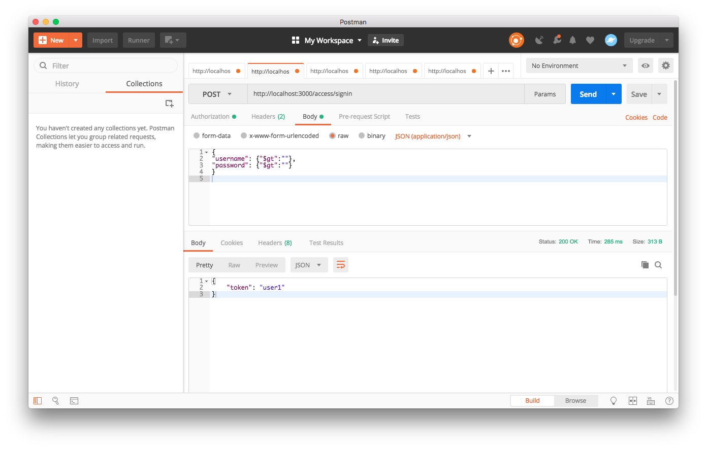
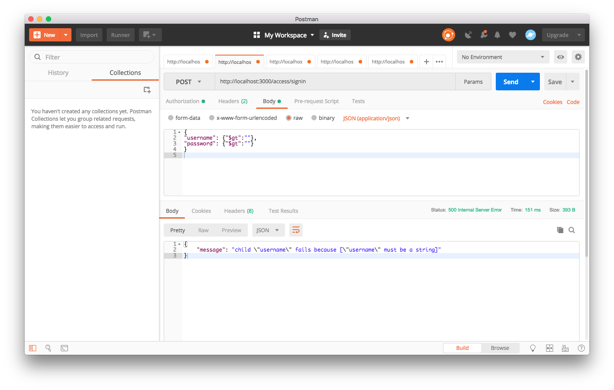

# Lab 4 - Input Validation

## Setup

* Start the Coinspread server application.
* Open Postman
* Notice the possible NoSQL injection when the following payload is sent in a POST request to URL: http://localhost:3000/access/signin
```json
{ 
    "username": {"$gt":""},
    "password": {"$gt":""}
}
```
As a result, a valid session token is retuned from the server for the first user in the users database.



## Tasks:

**Task 1: Create joi schema for sign up request body**


Inside `api\access\access.guard.js` create Joi schema Object for the sign in the request body. The schema should require username and password fields to be non-empty strings.

**Task 2: Validate sign-in request body against Joi schema:**
Inside `api\access\access.guard.js` add middleware `validateSignInRequest` with logic to validate sign-in request body against the Joi schema declared in Task 1. If not valid call next with a Boom badRequest error object.

**Task 3: Integrate validateSignInRequest middleware in the Router**
Inside `api\access\access.router.js`, for the `/signin` route, validate the request payload by invoking middleware `validateSignInRequest` middleware before executing the controller methods.

As a result of the input validations above, an attempt to perform NoSQL injection should fail with an error.


